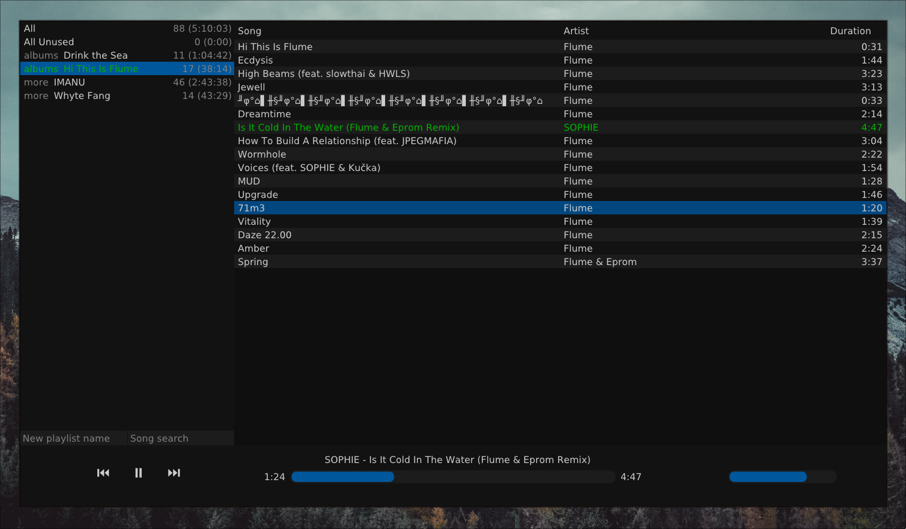

# ImPlayer

A music player to play and organize m3u8 playlists on Linux/Windows written in Rust using ImGui bindings.

## Features

* Play playlists
* Playlist management (add/remove songs and adjust their order)
* Rename song files

## Usage

Build: `cargo build --release`

Run: `cargo run --release -- <path to music directory>`

Hotkeys:
* `Space` Resume/pause playback
* `Ctrl+Left`/`Ctrl+Right` Play previous/next song
* `J`/`K` Move selected songs up/down
* `Delete` Remove song from playlist
* `Ctrl+Click`/`Shift+Click` Extended selection
* `Right-click` Context menu for more options

## Screenshot

## Why?

I want to synchronize my music and playlists across multiple devices (Android, Linux and Windows) using a file synchronization tool.
However, I could not find a suitable modern cross-platform music player that manages playlists only through m3u8 playlist files.

## Known Problems

* Playback/building may not work with some sample rate configurations (https://github.com/RustAudio/cpal/issues/593)
